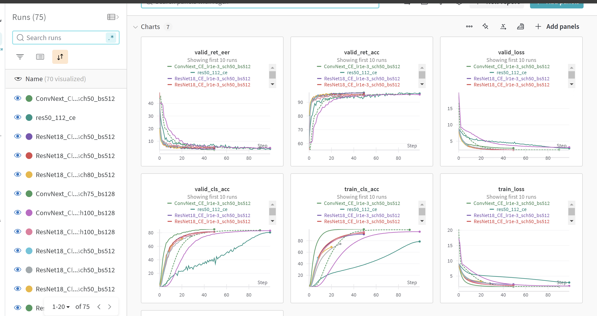

## Best Model

The best-performing approach in this project utilizes the ResNet50 architecture combined with the cross-entropy loss function. A useful trick involves modifying the preprocessing steps: during the training phase, the validation data is directly cropped to a size of 112. However, in the testing phase, resizing the validation data to 205 before cropping it to 112 yields a lower error rate.

## Usage

1. **Configuration**: All training configuration parameters, including model selection and cropping settings, are set in the `config.yaml` file. Please modify this file according to your needs.

2. **Run the Program**: Execute the following command in your terminal to start the program:
   ```bash
   python main.py
   ```
## File Structure
**dataset**: data processing scripts

**loss**: loss function scripts

**model**: different backend model i.e. ResNet18, ResNet50, ConvNext, SENet

